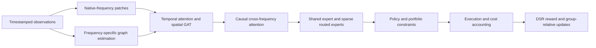

# Alex-Fin

**Adaptive portfolio allocation with multi-frequency graphs and reinforcement learning.**

English | [简体中文](README.zh-CN.md)

[Architecture](docs/architecture.md) · [Reported results](docs/results.md) · [Start learning](cases/01-causal-multifrequency-graphs.md) · [Contribute](CONTRIBUTING.md)

Alex-Fin studies how an investment policy can combine information arriving at different speeds, learn relationships among assets, and adapt its allocations as markets change. Its research design connects frequency-specific risk graphs, parallel temporal and spatial attention, sparse mixture-of-experts routing, and a portfolio adaptation of group-relative policy optimization.

The research manuscript reports **18.72% annualized return, 1.43 annualized Sharpe ratio, and 12.65% maximum drawdown** for its out-of-sample experiment. This public edition includes the authorized research source, an original architecture explanation, a transparent result record, and two practical learning cases. A public rerun of the manuscript experiment is pending; see the [evidence and reproduction requirements](docs/results.md).

## What you can do here

- Trace the full route from timestamped observations to feasible portfolio weights.
- Work through small examples of causal data alignment, graph construction, transaction costs, and risk-adjusted rewards.
- Audit a methodological claim or help turn the research description into a reproducible benchmark.

This edition is useful for learners with basic Python, linear algebra, probability, and financial return calculations. Familiarity with attention or reinforcement learning helps, but each case introduces the concepts it uses.

## Learning route

| Step | Material | Your deliverable |
| --- | --- | --- |
| 1. Understand the question | [Architecture](docs/architecture.md) | Draw the observation, decision, and execution timeline. |
| 2. Build a defensible graph | [Case 1: causal multi-frequency graphs](cases/01-causal-multifrequency-graphs.md) | A timestamp audit and an explanation of what a graph edge means. |
| 3. Evaluate a policy | [Case 2: costs, DSR, and policy comparison](cases/02-risk-rewards-and-evaluation.md) | A hand-checked reward calculation and an evaluation checklist. |
| 4. Inspect the evidence | [Reported results](docs/results.md) | One result or protocol question supported by a source. |
| 5. Contribute | [Contribution guide](CONTRIBUTING.md) | An issue or PR with calculations, sources, and expected behavior. |

## Research architecture



The manuscript describes seven frequencies from seconds to quarters; a single graph-attention layer; one shared expert and eight routed experts with two active per token; and daily portfolio decisions. These are research specifications. [Architecture](docs/architecture.md) explains the mathematical interfaces and the points that require explicit implementation decisions before a full rerun.

## Experiment record

| Model | Annualized return | Annualized Sharpe | Maximum drawdown magnitude |
| --- | ---: | ---: | ---: |
| **Alex-Fin** | **18.72%** | **1.43** | **12.65%** |
| MVO | 7.35% | 0.33 | 33.03% |
| PPO | 14.21% | 0.90 | 20.18% |
| CSI 300 index | 4.26% | 0.09 | 40.12% |

**Source:** author-supplied Alex-Fin research manuscript, Table 6-1. Values are manuscript-reported, rather than measurements produced by this documentation release. The stated test coverage is January 2017–February 2026. The [complete result record](docs/results.md) identifies assumptions, remaining evidence, and metric conventions.

## Current materials and next milestones

| Area | Available now | Next deliverable |
| --- | --- | --- |
| Research explanation | Bilingual architecture and source notes | A versioned specification resolving timing, graph, and constraint details |
| Education | Two bilingual cases with formulas, examples, exercises, and answers | Reviewed examples for each model module |
| Results | Manuscript-reported comparison and reproduction checklist | Dated run manifest, daily portfolio values, costs, and seed-level results |
| Implementation | [Model source and tests](docs/source-status.md), with revision hashes and an implementation review | Resolve the documented fidelity gaps, then freeze a reproduction environment |

The [source map](docs/source-status.md) connects the graph, encoder, expert, policy, reward, and training modules. It also records material differences between the source snapshot and manuscript design. Read those findings before interpreting any runner output. Model checkpoints and licensed financial datasets remain separate. [Microsoft Qlib](https://github.com/microsoft/qlib) is an upstream infrastructure reference with its own authorship and license.

## Try a small check

With Python 3.12 or newer, the teaching arithmetic checks use only the standard library and the released reward module:

```bash
python -m unittest discover -s tests -p "test_case_arithmetic.py" -v
```

They check fees, DSR, and drawdown without downloading data or training a model. See the [source guide](docs/source-status.md) for dependency installation, module checks, and implementation findings.

## First contributions

| Task | Suggested output | Acceptance criterion | Status |
| --- | --- | --- | --- |
| Audit time availability | A worked example in Case 1 | Distinguishes observation time, publication time, and execution time | Open |
| Specify graph meaning | A derivation linked from Architecture | Separates conditional dependence from forecast-error spillovers | Open |
| Reconcile evaluation settings | A protocol note linked from Results | Documents date ranges, costs, risk-free conversion, and rebalance timing | Open |

Choose a task in an issue, describe the evidence you will use, and submit a focused PR. Contributions should make the research easier to understand or independently assess.

## Sources and acknowledgments

The research builds on portfolio theory, Graphical Lasso, graph attention, sparse experts, and policy optimization. Primary references and their specific roles are collected in [Sources](docs/sources.md). Microsoft Qlib remains the work of its upstream authors and contributors and is distributed under its own [MIT license](https://github.com/microsoft/qlib/blob/main/LICENSE).

Original code is licensed under [MIT](LICENSE); original documentation is licensed under [CC BY-NC-SA 4.0](LICENSE-DOCS). Third-party materials retain their own licenses. This project presents research and learning materials; reported historical returns do not predict future investment performance.
