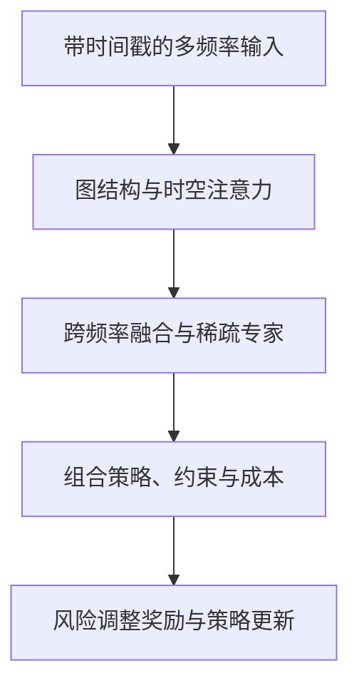

# Alex-Fin

**结合多频率图网络与强化学习的自适应投资组合配置研究。**

[English](README.md) | 简体中文

[研究架构](docs/architecture.zh-CN.md) · [实验结果](docs/results.zh-CN.md) · [开始学习](cases/01-causal-multifrequency-graphs.zh-CN.md) · [参与贡献](CONTRIBUTING.zh-CN.md)

Alex-Fin 研究如何把不同速度到达的金融信息结合起来，学习资产之间的关系，并随着市场变化调整投资组合。研究设计连接分频率风险图、并行的时间与空间注意力、稀疏混合专家路由，以及面向投资组合的群组相对策略优化。

研究稿报告的样本外实验结果为：**年化收益率 18.72%、年化夏普比率 1.43、最大回撤 12.65%**。本公开版本提供经过授权的研究源码、重新撰写的架构说明、明确来源的结果记录，以及两个实践学习案例。论文实验的公开复跑仍待完成，详见[证据与复现要求](docs/results.zh-CN.md)。

## 在这里可以获得什么

- 理解带时间戳的观测怎样经过各个模块，最终形成满足约束的投资组合权重。
- 用可手算的小例子学习因果时间对齐、图构建、交易成本与风险调整奖励。
- 审核一条方法陈述，或协助把研究说明整理为可复现的实验基准。

建议具备基础 Python、线性代数、概率和金融收益率知识。了解注意力或强化学习会有帮助；每个案例也会解释自身使用的概念。

## 学习路线

| 步骤 | 阅读材料 | 学习产出 |
| --- | --- | --- |
| 1. 理解问题 | [研究架构](docs/architecture.zh-CN.md) | 画出观测、决策、执行的时间线。 |
| 2. 构建有明确含义的图 | [案例一：因果多频率图](cases/01-causal-multifrequency-graphs.zh-CN.md) | 一份时间戳核对表，并解释图的边代表什么。 |
| 3. 评估决策 | [案例二：成本、DSR 与策略比较](cases/02-risk-rewards-and-evaluation.zh-CN.md) | 一份手算奖励过程和评估检查表。 |
| 4. 查看实验证据 | [实验结果](docs/results.zh-CN.md) | 提出一个有来源支持的结果或实验协议问题。 |
| 5. 参与协作 | [贡献指南](CONTRIBUTING.zh-CN.md) | 提交包含计算、来源和预期行为的 Issue 或 PR。 |

## 研究架构



研究稿描述了从秒级到季度的七类频率、单层图注意力、一个共享专家与八个路由专家（每个 Token 激活其中两个），以及日度投资组合决策。这些属于研究规格；[架构说明](docs/architecture.zh-CN.md)解释模块间的数学接口，以及完整复跑前需要明确的实现细节。

## 实验记录

| 模型 | 年化收益率 | 年化夏普比率 | 最大回撤幅度 |
| --- | ---: | ---: | ---: |
| **Alex-Fin** | **18.72%** | **1.43** | **12.65%** |
| MVO | 7.35% | 0.33 | 33.03% |
| PPO | 14.21% | 0.90 | 20.18% |
| 沪深300指数 | 4.26% | 0.09 | 40.12% |

**来源：**作者提供的 Alex-Fin 研究稿表 6-1。以上为论文报告结果，本次文档发布没有重新测量这些指标。研究稿声明的测试覆盖区间为 2017 年 1 月至 2026 年 2 月。[完整结果记录](docs/results.zh-CN.md)列明实验假设、待补证据和指标口径。

## 当前材料与下一步交付

| 方向 | 当前已有 | 下一项交付 |
| --- | --- | --- |
| 研究说明 | 双语架构与来源说明 | 明确时间、图语义与约束的版本化规格 |
| 教育内容 | 两个包含公式、例子、练习和参考答案的双语案例 | 各模型模块经过审阅的学习示例 |
| 结果记录 | 论文结果对照表与复现要求 | 带日期的运行清单、每日净值、成本与各随机种子结果 |
| 实现材料 | [模型源码与测试](docs/source-status.md)，附版本校验和实现核查 | 解决已记录的实现差异，再冻结复现环境 |

[源码导航](docs/source-status.md)连接图、编码器、专家、策略、奖励及训练模块，并记录源码快照与稿件设计之间的重要差异。解释运行结果前应先阅读这些发现。模型检查点和授权金融数据集单独管理。[Microsoft Qlib](https://github.com/microsoft/qlib)作为上游基础设施参考，保留其作者归属和许可。

## 运行一个小检查

使用 Python 3.12 或更新版本，教学算术检查只需要标准库和已发布的奖励模块：

```bash
python -m unittest discover -s tests -p "test_case_arithmetic.py" -v
```

检查覆盖费用、DSR 与回撤，无需下载数据或训练模型。依赖安装、模块检查和实现发现见[源码指南](docs/source-status.md)。

## 首次贡献任务

| 任务 | 建议交付 | 验收标准 | 状态 |
| --- | --- | --- | --- |
| 核对信息可用时间 | 案例一中的一个完整例子 | 区分观测时间、发布时间和执行时间 | 可认领 |
| 说明图的含义 | 架构页链接的一份推导 | 区分条件依赖与预测误差溢出 | 可认领 |
| 统一评估设置 | 结果页链接的一份协议说明 | 明确日期、成本、无风险利率转换与调仓时间 | 可认领 |

在 Issue 中认领任务并说明证据来源，再提交范围清楚的 PR。贡献应当帮助读者理解研究，或让研究更容易被独立检验。

## 来源与致谢

本研究借鉴投资组合理论、Graphical Lasso、图注意力、稀疏专家与策略优化方法。[来源说明](docs/sources.md)记录原始参考资料及其作用。Microsoft Qlib 由上游作者和贡献者开发，遵循自身的 [MIT 许可](https://github.com/microsoft/qlib/blob/main/LICENSE)。

原创代码使用 [MIT](LICENSE)，原创文档使用 [CC BY-NC-SA 4.0](LICENSE-DOCS)，第三方材料保留原有许可。本项目提供研究与学习资料；历史回测表现不能预测未来投资收益。
