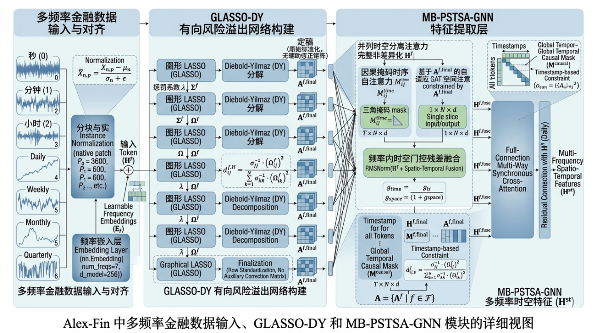

# 案例一：从多频率观测到图网络、专家与策略

[English](01-causal-multifrequency-graphs.md) | 简体中文 · [首页](../README.zh-CN.md) · [案例二](02-risk-rewards-and-evaluation.zh-CN.md)

**研究问题：**组合模型能否保留不同速度到达的信息、表示资产关系，并在选择权重之前自适应地处理这些表征？

本案例沿着[完整研究稿](https://github.com/Soros2040/julius-future/tree/main/works/alex-fin-paper)和[架构稿](https://github.com/Soros2040/julius-future/tree/main/works/alex-fin-architecture)阅读，再逐一对照公开源码。前置知识是矩阵代数、协方差、注意力与组合权重。小例子是手算说明，实验表格是历史稿件记录；阅读和贡献都不需要训练模型。

## 1. 从原始设计出发

**原稿插图：**七个频率分支进入 GLASSO-DY 与 MB-PSTSA-GNN，图中涉及原生频率分块和按时间构建的掩码。图像保持原样，当前源码实现的范围见下文。[图片来源清单](../docs/assets/manuscript/README.md)。

这个设计提出四个相接的问题：哪些观测已经可用，哪些资产关系影响聚合，哪些特征共享或专门化，以及表征如何变成组合。模块名称本身无法回答这些问题，答案取决于张量轴、估计窗口和收益核算约定。

## 2. 先确定可得性，再讨论频率对齐

稿件使用秒、分钟、小时、日、周、月、季度观测。令 $X_f\in\mathbb R^{T_f\times N\times d_f}$ 分别表示时间位置、资产和输入特征。长度为 $P_f$ 的片段投影到宽度 $D$：

$$
z_{f,k,i}=W_f\operatorname{vec}(\operatorname{Norm}(X_{f,k,i}))+e_f+e_i.
$$

频率嵌入标识分支，不能恢复缺失的观测；相同的嵌入宽度也不意味着序列长度相同。稿件使用 $D=256$ 和八个注意力头，`TrainConfig` 提供这些值；编码器独立构造时的默认值则是 $D=128$ 和四个头。

15:01 可用的收盘价可以进入 15:05 的决策；4 月 30 日发布的一季报不能因为报告期结束于 3 月 31 日就进入 4 月 29 日的决策。应保留事件时间、可得时间与修订时间。有效的注意力掩码满足

$$
M_{qk}=\begin{cases}0,&a_k\le t_q,\\-\infty,&a_k>t_q,\end{cases}
\qquad \operatorname{Attention}(Q,K,V)=\operatorname{softmax}(QK^\top/\sqrt D+M)V.
$$

这里 $a_k$ 是信息可得时间，而非行号。季度 Token 可以关注满足截点的更早分钟 Token；在资产轴上画三角形不能建立这种时间约束。稿件将使用完整收盘信息的决策与下一交易日开盘执行相连接。

[`_build_multi_frequency_inputs`](../src/training/trainer.py) 当前把日收盘价重采样成周、月、季末值，计算收益率、补零，返回 `[batch, asset, lookback]`。这是日数据的四种视图，并非七种独立观测流。源码核查需要记录周期标签、未完成周期、缺失状态，以及各值在决策截点是否已经可得。

## 3. 说明图的一条边代表什么

给定协方差估计 $S$，Graphical Lasso 估计稀疏精度矩阵：

$$
\widehat\Omega=\arg\min_{\Omega\succ0}\{\operatorname{tr}(S\Omega)-\log\det\Omega+\lambda\sum_{i\ne j}|\Omega_{ij}|\}.
$$

在高斯解释下，$\rho_{ij\mid-ij}=-\Omega_{ij}/\sqrt{\Omega_{ii}\Omega_{jj}}$ 表示条件关联。对角元素为 $4,9$、非对角元素为 $-3$ 时得到 $0.5$。这种对称关联不能直接证明干预意义上的因果关系。

稿件和 [`_dy_decomposition`](../src/agents/glasso_dy.py) 使用方差加权的精度矩阵平方表达式：

$$
d_{ij}=\frac{\sigma_{jj}^{-1}\Omega_{ij}^{2}}{\sum_k\sigma_{kk}^{-1}\Omega_{ik}^{2}}.
$$

对行 $[2,1]$ 和方差 $[1,4]$，两个分量为 $4/4.25\approx0.9412$ 与 $0.25/4.25\approx0.0588$。平方去掉了关联符号，不同分母可以产生非对称性，但这两个操作都没有引入预测步长。

常规广义预测误差方差分解还需要拟合动态模型、脉冲响应矩阵、创新协方差与预测期求和。函数接收 `H=5` 却没有使用它。因此应把当前输出作为已实现的图代理量研究；若要将其解释为经过验证的五步 Diebold–Yilmaz 度量，还需要单独推导。[原始方法文献](../docs/sources.md)。

**原稿图示：**位于图构建说明附近，没有随图提供带日期的边矩阵或运行清单。因此它展示图的表达方式，不能单独验证风险传导估计。原标题中的缺字保持原样。

`_row_normalize_spillover` 将对角线置零并按**列**归一化，定义 `A[i,j]` 为 `j → i`；零列向其他节点均匀分配权重。当各列都已归一化时，`sum(A)/N` 必然等于一，因而这一导出统计量无法衡量随时间变化的系统总风险。这是归一化的数学后果，无需运行代码即可判断。

## 4. 沿编码器追踪张量轴

稿件提出并行时间与空间分支：前者混合同一资产的有效时间，后者混合同一可用时点的资产邻居。图偏置接口可写为

$$
S_{ij}=q_i^\top k_j/\sqrt D+\beta A_{ij},\qquad h_i^{space}=\sum_j\operatorname{softmax}_j(S_{ij})v_j.
$$

偏置改变相对评分，硬掩码禁止某些边。规格必须先确定规则、自环和零边的处理方式，才能说明图怎样约束注意力。稿件随后融合分支，并依据时间戳交换频率 Token。

[`MBPSTSAGNNEncoder.forward`](../src/agents/mbpstsa_gnn.py) 的实际路径如下：

| 操作 | 张量或接口 | 解释 |
| --- | --- | --- |
| 输入投影 | `[B,N,L] → [B,N,D]` | 回看轴被线性投影吸收。 |
| 添加频率嵌入 | 每个资产 Token 一个频率向量 | 明确标识分支。 |
| `time_attn` | 在 `N` 上注意，使用 `N × N` 三角掩码 | 序列轴是资产，而非保留下来的时间。 |
| `_space_attention` | 传入 `adjacency`，加法代码被注释 | 当前输出不依赖传入的图。 |
| 跨频率注意力 | `[B,N,F,D] → [B*N,F,D]` | 对每个资产混合频率摘要。 |
| 频率均值 | `[B,N,D]` | Token 时间戳此前已被压缩。 |

空间注意力接收的还是 `h_time`，使这一段成为串行处理。这个具体研究快照需要继续对齐，才能对应稿件中的原生时间、并行时空与图约束架构。稿件的图消融不能直接归属于当前版本。

## 5. 把专家机制读成可检查的计算

设计使用一个共享专家、八个路由专家，每个 Token 选择两个路由输出：

$$
y=x+E_{shared}(\operatorname{RMSNorm}(x))+
\sum_{k\in\operatorname{Top2}(g(x)+b)}\widetilde p_k E_k(\operatorname{RMSNorm}(x)).
$$

被选中的概率 $0.4$ 和 $0.2$ 会重新归一化为 $2/3$ 和 $1/3$；共享路径始终激活。专业化需要通过路由和表征来评估，Top-2 本身无法识别所谓牛市专家、熊市专家。

[`AdaptiveMoE.forward`](../src/agents/moe.py) 实现了 RMSNorm、SwiGLU、Top-2 权重、偏置更新与残差 LayerNorm。三个区别影响研究结论：

- 它先计算**全部八个**专家，再对选中输出加权；稀疏选择还没有转化为稀疏计算。
- 稿件描述无辅助损失的负载均衡；源码将负载均衡平方损失与正交损失加入策略目标。
- 源码正交项比较共享输出与路由混合输出，稿件描述共享专家和所选专家之间的逐对约束。混合中的抵消不等价于逐对正交。

[`_compose_state_embed`](../src/training/trainer.py) 随后平均资产特征并加入补齐的风险因子；[`GRPOPolicy`](../src/agents/grpo.py) 将状态转为高斯潜在动作和 Softmax 权重。案例二继续核对奖励与评估。

## 6. 阅读现有机制证据

下面完整保留稿件表 6-2、6-3 的所有行，属于稿件声明的 2017 年 1 月至 2026 年 2 月样本外研究。运行配置、种子与逐日输出仍是连接历史结果和具体可执行版本所需的资料。回撤沿用原稿负收益符号。

### 表 6-2：频率输入设置

| 输入 | 年化收益率 | 年化夏普 | 最大回撤 |
| --- | ---: | ---: | ---: |
| 全七类频率 | 18.72% | 1.43 | -12.65% |
| 仅日度 | 13.15% | 0.92 | -20.37% |
| 仅高频：秒、分、小时 | 10.62% | 0.68 | -24.51% |
| 仅低频：周、月、季度 | 9.84% | 0.57 | -26.83% |
| 传统上下采样对齐 | 12.47% | 0.83 | -21.69% |

仅日度夏普下降 $1.43-0.92=0.51$，相对下降 $35.66\%$。这提示值得核查额外信息，却未单独区分数据覆盖、容量、对齐和调参预算的影响。公平比较需要控制这些条件；当前日数据构造器不能独自重建七频率比较。

### 表 6-3：不同市场中的专家模块

| 设置 | 牛市夏普 | 熊市夏普 | 震荡市夏普 | 全区间夏普 |
| --- | ---: | ---: | ---: | ---: |
| 完整 Alex-Fin | 1.57 | 0.98 | 1.36 | 1.43 |
| 移除 MoE | 1.12 | -0.15 | 0.87 | 0.87 |

熊市符号变化是一项已报告差异。若要解释为专家专业化，需要市场划分规则、路由分布、容量匹配的替代网络和种子不确定性；性能差异本身不能说明哪个专家学到了哪种经济机制。案例二列出行情日期及其覆盖缺口。

## 7. 源码阅读与贡献任务

| 源码 | 阅读重点 | 阅读产出 |
| --- | --- | --- |
| [频率嵌入](../src/agents/frequency_embedding.py)、[输入构造器](../src/training/trainer.py) | 标识、补齐、周期终点 | 一个决策的可得性表。 |
| [图估计器](../src/agents/glasso_dy.py) | 回退、预测期、方向、归一化 | 公式到函数的对应。 |
| [编码器](../src/agents/mbpstsa_gnn.py) | 张量轴、图的实际使用 | 带注释的形状追踪。 |
| [专家](../src/agents/moe.py) | 路由计算、损失 | 设计与源码对照。 |
| [策略](../src/agents/grpo.py) | 潜在密度、组合权重 | 动作空间解释。 |

**任务 A：轴核查。**通过 Issue 认领并复制[贡献记录](../contributions/first-review.md)，从 `[B,N,L]` 追踪到策略。验收：说明每个轴及掩码作用轴，区分源码事实与修改建议。

**任务 B：图的含义。**推导列归一化为什么固定矩阵总和，并指出预测期应进入动态分解的何处。验收：提供公式、具体函数和一手方法来源。

**任务 C：机制证据。**选择表 6-2 或 6-3 一行，写出其最小比较清单。验收：保留原数值，列明可得性、容量与调参控制、不确定性要求。

按[协作流程](../CONTRIBUTING.zh-CN.md)在 `contributions/` 提交聚焦的记录。这些任务需要阅读和推导，不需要运行实验。
